# Release Process & lib/ Synchronization Guide

## 📋 Overview

This document explains how to maintain synchronization between `src/` (TypeScript source) and `lib/` (compiled JavaScript) in the repository.

## ⚠️ Critical Principle

**The `lib/` folder MUST always be in sync with `src/`**

Since we commit the compiled `lib/` folder to the repository and skip compilation during `npm install` (for performance), it's **critical** that `lib/` is always up-to-date with `src/`.

---

## 🛡️ Safety Mechanisms

We have **4 layers of protection** to prevent `lib/` from becoming out of sync:

### 1. **Automated CI Validation** (GitHub Actions)

**Workflow:** `.github/workflows/validate-lib-sync.yml`

Runs on:
- Every push to `main`
- Every pull request
- Before releases

**What it does:**
1. Compiles TypeScript from `src/`
2. Compares output with committed `lib/`
3. **Fails the build** if there are differences

**View results:** Check the "✅ Validate lib/ Sync" check in PR/commits

---

### 2. **Pre-release Validation** (npm script)

**Script:** `npm run validate:lib-sync`

**When it runs:**
- Automatically before `npm run release` (via `prerelease` hook)
- Manually by developers

**What it does:**
```bash
npm run validate:lib-sync
```

- Compiles TypeScript
- Checks for differences
- Shows detailed diff if out of sync
- **Exits with error** if validation fails

**Output:**
```
✅ SUCCESS: lib/ is in sync with src/
```

---

### 3. **Release Workflow Protection** (GitHub Actions)

**Workflows:**
- `.github/workflows/publish-release.yml`
- `.github/workflows/manual-release.yml`

**What they do:**

#### publish-release.yml (Tag-based release)
1. Validates `lib/` sync
2. Re-compiles TypeScript as safety check
3. **Fails release** if differences detected
4. Publishes to npm

#### manual-release.yml (Manual release)
1. Validates `lib/` sync
2. Re-compiles TypeScript
3. **Auto-commits** `lib/` changes if any
4. Continues with release

---

### 4. **Pre-commit Hook** (Optional, Manual Setup)

**Script:** `scripts/pre-commit-compile.sh`

**Setup (optional):**
```bash
# Option A: Using Git hooks directly
ln -s ../../scripts/pre-commit-compile.sh .git/hooks/pre-commit

# Option B: Using Husky (if installed)
npx husky add .husky/pre-commit "bash scripts/pre-commit-compile.sh"
```

**What it does:**
- Detects if `.ts` files in `src/` changed
- Auto-compiles TypeScript
- Auto-stages `lib/` changes
- Includes in the same commit

**Benefits:**
- Prevents forgetting to compile
- Keeps commits atomic (src + lib together)
- No manual steps needed

---

## 🔄 Development Workflow

### When Making Changes to `src/`

#### Option 1: Manual Compilation (Default)

```bash
# 1. Make changes to src/
vim src/Utils/retry-utils.ts

# 2. Compile TypeScript
npm run build:tsc

# 3. Verify changes
git status

# 4. Commit both src/ and lib/ together
git add src/Utils/retry-utils.ts lib/Utils/retry-utils.js lib/Utils/retry-utils.d.ts
git commit -m "feat: add retry utilities"

# 5. Push
git push
```

#### Option 2: With Pre-commit Hook (Automated)

```bash
# 1. Setup hook once (one-time)
ln -s ../../scripts/pre-commit-compile.sh .git/hooks/pre-commit

# 2. Make changes to src/
vim src/Utils/retry-utils.ts

# 3. Stage and commit (compilation happens automatically!)
git add src/Utils/retry-utils.ts
git commit -m "feat: add retry utilities"
# Hook auto-compiles and includes lib/ changes

# 4. Push
git push
```

---

## 🚀 Release Workflow

### Automated Release (Recommended)

```bash
# 1. Ensure all changes are committed
git status

# 2. Run manual release workflow
# Go to GitHub Actions → Manual Release → Run workflow
# Select increment: patch, minor, major

# 3. Workflow automatically:
#    - Validates lib/ sync
#    - Compiles if needed
#    - Auto-commits lib/ if out of sync
#    - Creates tag
#    - Triggers publish workflow
```

### Manual Release (Alternative)

```bash
# 1. Ensure lib/ is in sync
npm run validate:lib-sync

# 2. If out of sync, compile
npm run build:tsc

# 3. Commit lib/ changes
git add lib/
git commit -m "chore: sync lib/ with src/"
git push

# 4. Create tag
git tag v6.7.19
git push --tags

# 5. Publish workflow triggers automatically
```

---

## ⚠️ Troubleshooting

### Problem: CI fails with "lib/ is out of sync"

**Symptom:**
```
❌ ERROR: lib/ folder is out of sync with src/
```

**Solution:**
```bash
# 1. Compile TypeScript
npm run build:tsc

# 2. Check what changed
git diff lib/

# 3. Commit the changes
git add lib/
git commit -m "chore: sync lib/ with src/"
git push
```

---

### Problem: Pre-commit hook not running

**Check if hook is installed:**
```bash
ls -la .git/hooks/pre-commit
```

**Reinstall hook:**
```bash
ln -sf ../../scripts/pre-commit-compile.sh .git/hooks/pre-commit
chmod +x .git/hooks/pre-commit
```

---

### Problem: TypeScript compilation errors

**Symptom:**
```
error TS2322: Type 'string' is not assignable to type 'number'
```

**Solution:**
```bash
# 1. Fix TypeScript errors in src/
vim src/path/to/file.ts

# 2. Verify compilation works
npx tsc --noEmit

# 3. When fixed, compile
npm run build:tsc

# 4. Commit
git add src/ lib/
git commit -m "fix: resolve TypeScript errors"
```

---

### Problem: Release failed due to lib/ sync

**If publish-release.yml fails:**

1. Check the GitHub Actions logs
2. Identify which files are out of sync
3. Locally:
   ```bash
   npm run build:tsc
   git add lib/
   git commit -m "chore: sync lib/ for release"
   git push
   ```
4. Delete and recreate the tag:
   ```bash
   git tag -d v6.7.19
   git push origin :refs/tags/v6.7.19
   git tag v6.7.19
   git push --tags
   ```

---

## 📊 Validation Commands

### Quick Check
```bash
npm run validate:lib-sync
```

### Detailed Check
```bash
# Compile
npx tsc

# Check diff
git diff lib/

# Show changed files only
git diff --name-only lib/
```

### Type-check Only (No Compilation)
```bash
npx tsc --noEmit
```

---

## 🎯 Best Practices

### ✅ DO

- **Always compile** after changing `src/`
- **Commit `src/` and `lib/` together** in the same commit
- **Run `npm run validate:lib-sync`** before creating PRs
- **Use pre-commit hook** for automatic compilation
- **Let CI validate** before merging

### ❌ DON'T

- **Don't commit `src/` without `lib/`**
- **Don't manually edit `lib/`** (always regenerate from `src/`)
- **Don't skip CI checks** - they catch sync issues
- **Don't force-push tags** without re-syncing `lib/`
- **Don't use `git commit --no-verify`** (bypasses hooks)

---

## 🔧 CI/CD Pipeline

```mermaid
graph TD
    A[Developer commits] --> B{Pre-commit hook?}
    B -->|Yes| C[Auto-compile TypeScript]
    B -->|No| D[Push to GitHub]
    C --> E[Auto-stage lib/ changes]
    E --> D
    D --> F[CI: Validate lib/ sync]
    F -->|✅ In sync| G[CI passes]
    F -->|❌ Out of sync| H[CI fails]
    G --> I{Is tag?}
    I -->|Yes| J[Release workflow]
    I -->|No| K[End]
    J --> L[Validate lib/ again]
    L --> M[Compile safety check]
    M --> N[Publish to npm]
```



---

## 📚 Related Files

- **CI Validation:** `.github/workflows/validate-lib-sync.yml`
- **Release Workflows:**
  - `.github/workflows/publish-release.yml`
  - `.github/workflows/manual-release.yml`
- **Validation Script:** `scripts/validate-lib-sync.js`
- **Pre-commit Hook:** `scripts/pre-commit-compile.sh`
- **Package Scripts:** `package.json` (see `validate:lib-sync` and `prerelease`)

---

## 🆘 Getting Help

If you encounter issues:

1. Check this document first
2. Run `npm run validate:lib-sync` for detailed errors
3. Check GitHub Actions logs for CI failures
4. Review recent commits to see sync patterns
5. Ask in team chat or open an issue

---

## 📝 Summary

| Layer | When | Action | Auto? |
|-------|------|--------|-------|
| Pre-commit Hook | Every commit | Compile + stage lib/ | ✅ Optional |
| CI Validation | Every push/PR | Validate sync | ✅ Yes |
| Pre-release Script | Before release | Validate sync | ✅ Yes |
| Release Workflow | On tag/manual | Validate + compile | ✅ Yes |

**With these 4 layers, it's nearly impossible for `lib/` to become out of sync!**
